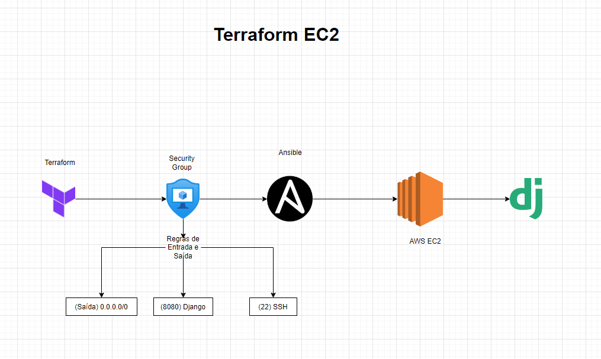

# 🌍 Infraestrutura Django com Terraform e Ansible

Este projeto provisiona uma instância AWS EC2 com **Terraform** e configura um ambiente **Django** automaticamente usando **Ansible**.

## 📌 Arquitetura



O projeto segue a estrutura abaixo:

1. **Terraform** cria a instância EC2 e configura o Security Group com regras de entrada e saída.
2. **Ansible** acessa a instância via SSH e instala os pacotes necessários.
3. **Django** é configurado e executado na instância AWS EC2.

## 🚀 Tecnologias Utilizadas
- **Terraform** 🏗️ – Provisionamento da infraestrutura na AWS.
- **Ansible** ⚙️ – Automação da configuração do servidor.
- **Django** 🖥️ – Framework Web em Python para desenvolvimento da aplicação.

## 📂 Estrutura do Projeto

```plaintext
📦 projeto-infra
├── 📂 terraform/              # Código Terraform para provisionamento da infraestrutura
│   ├── main.tf                # Configuração principal do Terraform
│   ├── variables.tf           # Variáveis usadas no Terraform
│   ├── outputs.tf             # Definição de outputs do Terraform
│   ├── provider.tf            # Configuração do provedor AWS
│   ├── security_group.tf      # Regras do Security Group
│   ├── playbook.yml           # Playbook para configuração do servidor
│   ├── hosts.yml              # Inventário de hosts Ansible
├── 📜 README.md               # Documentação do projeto
